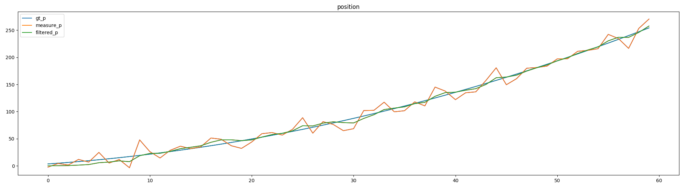
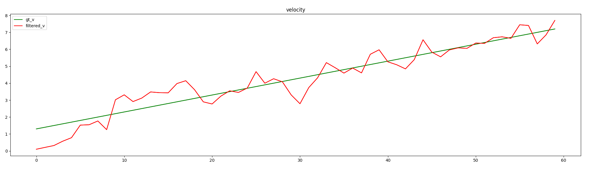

# 实验报告

> 在绘制图形时使用了：[matplotlib-cpp](https://github.com/lava/matplotlib-cpp)
>
> 需要安装依赖：sudo apt-get install python-matplotlib python-numpy python2.7-dev

## 1. 线性卡尔曼滤波

### 1.1 运动模型

为了深入了解卡尔曼滤波，我通过代码实现了一个线性卡尔曼滤波的过程。

其运动模型是一个拥有初速度，并且以恒定加速度直线运动的系统。

状态转移矩阵如下：
$$
x_t  = A  x_{t-1} + B * u
$$

测量模型如下：
$$
y_t = Cx_t
$$

带入上述运动系统中：
$$
\left[
\begin{matrix}
 \hat p_t \\ \hat v_t
\end{matrix}
\right]
=\left[
\begin{matrix}
1 & T \\ 0 & 1
\end{matrix}
\right]
\left[
\begin{matrix}
p_{t-1} \\ v_{t-1}
\end{matrix}
\right]
+\left[
\begin{matrix}
0.5 T^2 \\ T
\end{matrix}
\right]
\left[
\begin{matrix}
a
\end{matrix}
\right]
$$

$$
\left[
\begin{matrix}
y_t
\end{matrix}
\right]
= \left[
\begin{matrix}
1 & 0
\end{matrix}
\right]
\left[
\begin{matrix}
\hat p_t \\ \hat v_t
\end{matrix}
\right]
$$

### 1.2 实验结果

> 对应的源码在：`lecture_3_gaussian_filter/code/kalman_filter_example.cpp`

**位移**

**速度**

**结论**：通过上图可以发现在状态量为位移和速度，而观测量为位移时，位移的状态可以很快收敛，并且最终在一个较小的范围波动。但是对于上面的例子，速度在刚开始的时候收敛的比较快。

