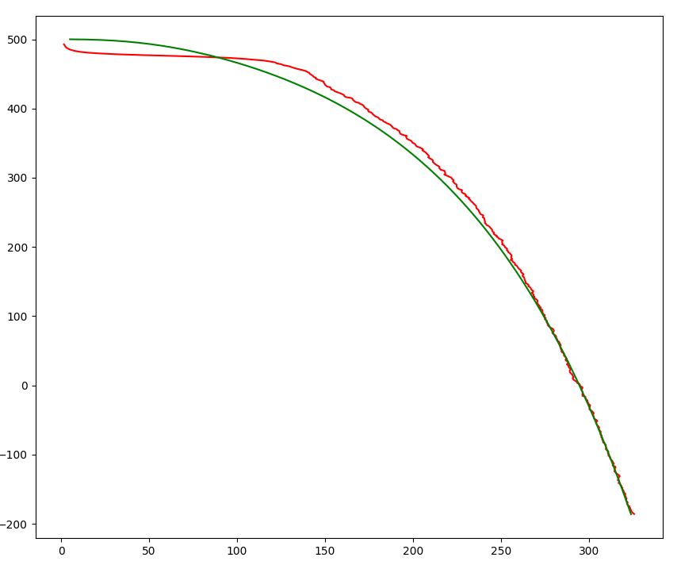

# 实验报告

> 在绘制图形时使用了：[matplotlib-cpp](https://github.com/lava/matplotlib-cpp)
>
> 需要安装依赖：sudo apt-get install python-matplotlib python-numpy python2.7-dev

## 1. 线性卡尔曼滤波

### 1.1 运动模型

为了深入了解卡尔曼滤波，我通过代码实现了一个线性卡尔曼滤波的过程。

其运动模型是一个拥有初速度，并且以恒定加速度直线运动的系统。

状态转移矩阵如下：
$$
x_t  = A  x_{t-1} + B * u
$$

测量模型如下：
$$
y_t = Cx_t
$$

带入上述运动系统中：
$$
\left[
\begin{matrix}
 \hat p_t \\ \hat v_t
\end{matrix}
\right]
=\left[
\begin{matrix}
1 & T \\ 0 & 1
\end{matrix}
\right]
\left[
\begin{matrix}
p_{t-1} \\ v_{t-1}
\end{matrix}
\right]
+\left[
\begin{matrix}
0.5 T^2 \\ T
\end{matrix}
\right]
\left[
\begin{matrix}
a
\end{matrix}
\right]
$$

$$
\left[
\begin{matrix}
y_t
\end{matrix}
\right]
= \left[
\begin{matrix}
1 & 0
\end{matrix}
\right]
\left[
\begin{matrix}
\hat p_t \\ \hat v_t
\end{matrix}
\right]
$$

### 1.2 实验结果

> 对应的源码在：`lecture_3_gaussian_filter/code/kalman_filter_example.cpp`

**位移**

**速度**

**结论**：通过上图可以发现在状态量为位移和速度，而观测量为位移时，位移的状态可以很快收敛，并且最终在一个较小的范围波动。但是对于上面的例子，速度在刚开始的时候收敛的比较快。

## 2. 非线性卡尔曼滤波

### 2.1 运动模型

上述模型表述了一个自由落体运动，并且考虑了阻尼。

运动方程如下：
$$
X_t = X_{t-1} + V_{x(t-1)} \Delta t \\
V_{x(t)} = V_{x(t-1)}-{k_x} V^2_{x(t-1)}\Delta t \\
Y_t = Y_{t-1} + V_{y(t-1)}\Delta t \\
V_{y(t)} = V_{y(t-1)} + [k_yV^2_{y(t-1)} -g]\Delta t
$$
测量方程如下：
$$
r = \sqrt{x^2+y^2} \\
\alpha = \arctan\frac{x}{y}
$$
其中：$k_x$是x方向的阻尼系数

### 2.2 实验结果

**结论：**可以看出来即使在初值相差较远时系统也能最终收敛到一个比较好的状态，但是由于设置的测量方差比较大，所以系统的状态虽然收敛了，但是局部的震荡还是比较大的。

